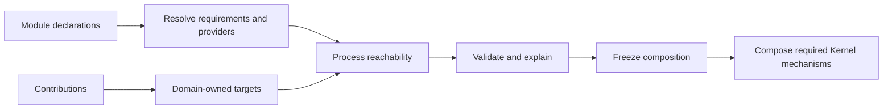

# rustclamp-kernel

Planned home for Clamp composition and resolution contracts.

Phase 0 scaffold. There are no public contracts yet. This package builds alone
with Rust 1.96.1 and has no dependencies. Publishing is disabled until licensing,
registry ownership and the first prototype API have been reviewed.

The planned composition path is module declarations, capability resolution,
domain-owned contribution targets, process reachability, validation, freeze,
then only the coordination mechanisms that process requires.



| Baseline | Current result |
| --- | --- |
| External Rust dependencies | 0 |
| Public composition behavior | 0 |
| Tokio, HTTP, or database dependency | None |
| Behavioral architecture fixtures | None yet |

There is no Kernel behavior to benchmark yet. The capability prototype will compare
typed selection with invalid missing and ambiguous cases; later process tests must
distinguish unreachable runtime work from dependencies or bytes removed from a
binary.

```sh
cargo fmt --all -- --check
cargo clippy --offline --locked --all-targets --all-features -- -D warnings
cargo test --offline --locked --all-features
RUSTDOCFLAGS="-D warnings" cargo doc --offline --locked --no-deps --all-features
```

For coordinated checkout, architecture checks, measurements, and release policy,
see the [facade contributor guide](https://github.com/rustclamp/rustclamp/blob/main/CONTRIBUTING.md).
The configured remote is `https://github.com/rustclamp/kernel.git`; repository existence
and public visibility were verified during Phase 0.
