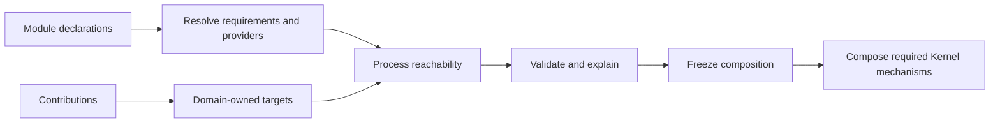

# rustclamp-kernel

The **Kernel component of RustClamp**, the framework in the
[`rustclamp`](https://github.com/rustclamp/rustclamp) repository. Kernel is
responsible for composition, capability resolution, and process validation.

This is a companion package, not a standalone framework. It provides typed
capability resolution and a process-projection prototype over a caller-owned
application blueprint. Projection resolution includes providers, defaults,
explicit choices, replacements, exclusions, and qualified contributions;
`freeze` consumes the blueprint and returns separate runtime and inspection
views. It depends only on Core and builds with Rust 1.96.1. Publishing is
disabled until licensing, registry ownership and the prototype API have been
reviewed.

The planned composition path is module declarations, capability resolution,
domain-owned contribution targets, process reachability, validation, freeze,
then only the coordination mechanisms that process requires.



| Baseline | Current result |
| --- | --- |
| External Rust dependencies | 0 |
| Internal dependencies | Core only |
| Public composition behavior | Typed resolution/cardinality, construction-cycle validation, contribution assembly, process-root reachability, provider selection/replacement, projection-scoped validation, and consuming freeze prototype |
| Tokio, HTTP, or database dependency | None |
| Behavioral architecture fixtures | CLI contribution target and CLI/Worker process-projection examples |

## Phase 2 Measurements

Measured on Rust/Cargo 1.96.1, x86_64 Linux, AMD Ryzen 5 PRO 4650U, release
profile. Resolver timings are nine-sample medians over fixed-clock operations;
build measurements use five runs.

| Metric | Result |
| --- | ---: |
| Direct typed access | 2 ns/op |
| Resolve one provision | 6 ns/op |
| Select from 2 provisions | 12 ns/op |
| Select from 8 provisions | 28 ns/op |
| Resolve qualified `Primary`, one / eight | 5 / 27 ns/op |
| Optional absent / one provider | 7 / 3 ns/op |
| Collect all providers, 2 / 8 | 17 / 40 ns/op |
| Remove module and revalidate | 36 ns/op |
| Replace provider and revalidate | 62 ns/op |
| Clean build median | 467.77 ms |
| Unchanged rebuild median | 39.47 ms |
| Example binary | 4,357,888 B |
| Process wall-time median | 1.484 ms |

For context, Phase 1's Pico example measured 269.18 ms clean build, 135.15 ms
unchanged rebuild, 4,335,592 B binary, and 1.256 ms process wall time. These are
different programs and dependency graphs, so their cross-phase deltas are not a
valid performance comparison. Phase 1's apples-to-apples result is Pico versus
plain Rust: +36.78 ms clean build, +1.67 ms unchanged rebuild, and 0 B binary
size difference. Earlier Phase 2 runs measured unqualified paths at 5/12/31,
7/11/27, 8/12/29, and 6/21/27 ns; the latest run is 6/12/28 ns. The latest
two-provider range was 12-13 ns. Qualified, optional,
many, module-removal, and replacement measurements are listed above. Runs used
different source snapshots, not isolated feature comparisons; graph edits
include copying and revalidating the composition. The first five-run example
build was 416.90 ms clean / 40.37 ms unchanged, 4,365,760 B, and 1.516 ms process
wall; the current version is +50.87 ms / -0.89 ms, -7,872 B, and -0.032 ms.
This is a source-version comparison, not causal attribution. Raw samples and method are in the
[Phase 2 evidence](https://github.com/rustclamp/rustclamp/blob/main/docs/evidence/phase2.md)
and [Phase 1 comparison](https://github.com/rustclamp/rustclamp/blob/main/docs/evidence/phase1.md).

`CapabilityComposition` is a caller-owned snapshot for one capability type.
`without_module` removes that module's provision and owned requirement;
`replace_provider` changes only that capability provision and redirects explicit
selections. Both edits create a new snapshot, and `validate` checks every
remaining consumer before adoption. These are composition-planning operations,
not runtime module construction or a full application graph. Full timing methods,
sample ranges, and limitations are in the [Phase 2 evidence](https://github.com/rustclamp/rustclamp/blob/main/docs/evidence/phase2.md).

`ConstructionGraph` separately validates caller-declared module construction
dependencies. It returns a structured, closed module path for a cycle and
selects diagnostics deterministically. It does not construct modules or support
lazy/proxy dependencies. Validation uses an explicit traversal stack, so graph
depth does not consume the call stack; a 2,048-module chain is covered by a Rust
test. The latest P2-09 microbench used nine samples of 100,000 validations each
on the same single host: an acyclic 8-module chain measured 1.652 us/op and an
8-module cycle measured 1.346 us/op, including diagnostic-path construction.
The Phase 2 scale probe selected an explicit Clock provider from 1/5/20
synthetic modules at 9/20/39 ns/op. Construction-chain validation at 5/20
modules measured 939/5,735 ns/op. An earlier exploratory cycle-check run
measured 1.780/1.438 us/op; these are separate runs, not a controlled A/B
comparison. All are advisory observations, not performance targets or
broad-scale guarantees.

Core's `Module`, `Requires<C>`, and `Provides<C>` are additive contracts. The
Kernel adapts them into existing resolver declarations with
`CapabilityRequirement::from_module` and `Provision::from_module`; a provider
does not need to implement unrelated lifecycle hooks.

`TargetComposition<T, Q>` collects one typed contribution declaration and
qualifier. It either passes the declarations to the selected Core
`ContributionTarget` or reports required declarations left unconsumed in that
active composition. A missing target with no required declarations is a no-op.
The target owns domain conflicts, ordering, empty-input behavior, and the
runtime representation; Kernel knows no command, route, schedule, or migration
rules. The qualifier is carried in the Rust type, so contribution types for
different interfaces cannot be mixed accidentally. Process-aware reachability,
resolution, and freezing are demonstrated as an in-memory Phase 4 prototype;
normal runtime construction and lifecycle coordination remain unfinished.

The Phase 3 CLI fixture measures target assembly at 86 ns per two-command
build (nine-sample median) and reports 96 bytes of runtime tree storage. It
adds no internal dependency beyond Core and Kernel. This is a synthetic
microbenchmark; allocation calls are not instrumented, and Phase 2 build
numbers are not a fair before/after comparison. See the
[Phase 3 evidence](https://github.com/rustclamp/rustclamp/blob/main/docs/evidence/phase3.md).

`ApplicationBlueprint` records execution roots, modules, capability providers
and requirements, selection defaults, replacements, exclusions, target
consumers, and contributions. `project(ProcessId)` resolves only reachable
declarations and returns process-aware errors, inclusion paths, relation views,
and exclusion reasons. `freeze(ProcessId)` consumes the blueprint and creates a
compact runtime plan plus immutable inspection metadata. The process example
validates Worker-only configuration and callback isolation. This remains a
prototype; automatic construction and full lifecycle management are out of
scope. Measurements and limits are in the
[Phase 4 evidence](https://github.com/rustclamp/rustclamp/blob/main/docs/evidence/phase4.md).

```sh
cargo fmt --all -- --check
cargo clippy --offline --locked --all-targets --all-features -- -D warnings
cargo test --offline --locked --all-features
RUSTDOCFLAGS="-D warnings" cargo doc --offline --locked --no-deps --all-features
```

For coordinated checkout, architecture checks, measurements, and release policy,
see the [facade contributor guide](https://github.com/rustclamp/rustclamp/blob/main/CONTRIBUTING.md).
The configured remote is `https://github.com/rustclamp/kernel.git`; repository existence
and public visibility were verified during Phase 0.
