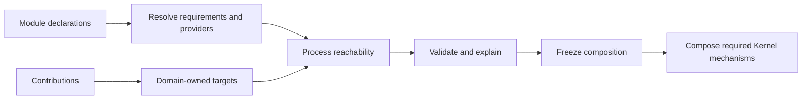

# rustclamp-kernel

The **Kernel component of RustClamp**, the framework in the
[`rustclamp`](https://github.com/rustclamp/rustclamp) repository. Kernel is
responsible for composition, capability resolution, and process validation.

This is a companion package, not a standalone framework. It currently resolves
one typed capability at a time; application-wide modules and process composition
are not implemented. It depends only on Core and builds with Rust 1.96.1.
Publishing is disabled until licensing, registry ownership and the prototype API
have been reviewed.

The planned composition path is module declarations, capability resolution,
domain-owned contribution targets, process reachability, validation, freeze,
then only the coordination mechanisms that process requires.



| Baseline | Current result |
| --- | --- |
| External Rust dependencies | 0 |
| Internal dependencies | Core only |
| Public composition behavior | Single-capability resolution |
| Tokio, HTTP, or database dependency | None |
| Behavioral architecture fixtures | None yet |

## Phase 2 Measurements

Measured on Rust/Cargo 1.96.1, x86_64 Linux, AMD Ryzen 5 PRO 4650U, release
profile. Resolver timings are nine-sample medians over fixed-clock operations;
build measurements use five runs.

| Metric | Result |
| --- | ---: |
| Direct typed access | 2 ns/op |
| Resolve one provision | 8 ns/op |
| Select from 2 provisions | 12 ns/op |
| Select from 8 provisions | 29 ns/op |
| Resolve qualified `Primary` provision | 6 ns/op |
| Select qualified `Primary` from 8 | 27 ns/op |
| Optional absent / one provider | 6 / 3 ns/op |
| Collect all providers, 2 / 8 | 17 / 40 ns/op |
| Clean build median | 451.79 ms |
| Unchanged rebuild median | 41.87 ms |
| Example binary | 4,357,888 B |
| Process wall-time median | 1.297 ms |

For context, Phase 1's Pico example measured 269.18 ms clean build, 135.15 ms
unchanged rebuild, 4,335,592 B binary, and 1.256 ms process wall time. These are
different programs and dependency graphs, so their cross-phase deltas are not a
valid performance comparison. Phase 1's apples-to-apples result is Pico versus
plain Rust: +36.78 ms clean build, +1.67 ms unchanged rebuild, and 0 B binary
size difference. Earlier Phase 2 runs measured unqualified paths at 5/12/31 ns
and then 7/11/27 ns for unique/two/eight providers. The latest run is 8/12/29 ns;
qualified paths are 6/27 ns for one/eight providers. Optional absence/one
provider is 6/3 ns; collecting all providers takes 17/40 ns for two/eight. The
resolver and harness changed between runs, so these are snapshots rather than
isolated feature comparisons. Many-provider timing includes an allocated output
vector. The first five-run example build was 416.90 ms clean / 40.37 ms unchanged,
4,365,760 B, and 1.516 ms process wall; the current version is +50.53 ms / +0.12
ms, -7,872 B, and -0.063 ms respectively. This is a source-version comparison,
not a causal attribution to the features. Raw samples and method are in the
[Phase 2 evidence](https://github.com/rustclamp/rustclamp/blob/main/docs/evidence/phase2.md)
and [Phase 1 comparison](https://github.com/rustclamp/rustclamp/blob/main/docs/evidence/phase1.md).

The capability prototype tests missing, ambiguous, and explicitly selected
provisions. On the recorded host, the first in-process benchmark measured these
median costs:

| Path | Median per resolution |
| --- | ---: |
| Direct typed access | 2 ns |
| One provision (latest run) | 8 ns |
| Explicit selection from two (latest run) | 12 ns |
| Explicit selection from eight (latest run) | 29 ns |
| Qualified one provision | 5 ns |
| Qualified explicit selection from eight | 27 ns |

These are nine-sample microbenchmark medians over a fixed clock, not end-to-end
application latency guarantees. Build, binary, and process observations plus
raw timing samples are in the [Phase 2 evidence](https://github.com/rustclamp/rustclamp/blob/main/docs/evidence/phase2.md).
Later process tests must distinguish unreachable runtime work from dependencies
or bytes removed from a binary.

```sh
cargo fmt --all -- --check
cargo clippy --offline --locked --all-targets --all-features -- -D warnings
cargo test --offline --locked --all-features
RUSTDOCFLAGS="-D warnings" cargo doc --offline --locked --no-deps --all-features
```

For coordinated checkout, architecture checks, measurements, and release policy,
see the [facade contributor guide](https://github.com/rustclamp/rustclamp/blob/main/CONTRIBUTING.md).
The configured remote is `https://github.com/rustclamp/kernel.git`; repository existence
and public visibility were verified during Phase 0.
